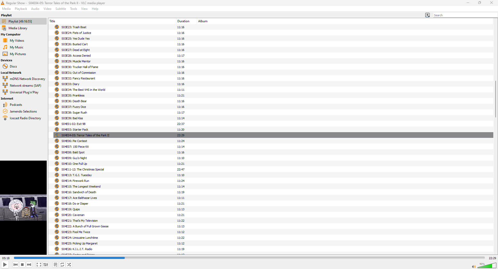

# Jellylist
#### (formerly GetLink)
Web server that creates M3U files for TV shows on a Jellyfin instance.

## Setup
**To read the version of this README that works with the version of Jellylist you have, go to `https://github.com/thepwrtank18/Jellylist/tree/[version]`.**

*These instructions only work for Windows 10/Server 2016 or later. Linux or macOS have not been tested yet, but builds are available. No Windows-specific features have been used, so it should be fine as long as you have .NET 7 installed. Windows 8.1/Server 2008 R2, macOS 10.15 Catalina or earlier is not supported (rip windows 7). Linux may vary, see https://learn.microsoft.com/en-us/dotnet/core/install/linux.*
1. Download the latest release.
2. Put the folder somewhere safe.
3. Open up a terminal in that area.
4. Type in `Jellylist.exe --urls http://localhost:[port] --jellyfinUrl [URL to Jellyfin instance]`

After that, the web server is set up (minus port forwarding and stuff, but that's your problem to deal with).

To play a TV show or album in VLC, you'll need it's ID. You can find the ID in the URL of a TV show or album (ex: https://demo.jellyfin.org/web/index.html#!/details?id=05991932707d2c668148d8ed19cdb544).
* For TV shows, put this into your media player: `http://localhost:[port]/GetTV?seriesId=[id]`
* For albums, put this in instead: `http://localhost:[port]/GetAlbum?albumId=[id]`

Due to how Basic Authentication works, you need to add a backslash (\) behind each colon (:) in your username and password, so Jellylist can process it properly.

What you see on album covers and other metadata beyond the album and track name relies **entirely** on the metadata inside the file.

If you don't want to use Basic Auth (or your media player doesn't support it), you can put the username and password into the URL as `&username=[username]&password=[password]`, or use an auth token or API key by using the `authToken` parameter.

If you want to mass download an entire show or album with a program like Free Download Manager, or your media player doesn't support EXTM3U, you can add `&returnType=txt` to the end, removing all metadata other than download links.

You don't have to be a manager of the Jellyfin instance for this to work, but your account needs to have download permissions, as your player is downloading the original file.

Note that unless you're using a dedicated API key for the `authToken` parameter, these files will stop working after a while! It's best not to save the m3u files, and rather to put the URL directly in your media player of choice.

## Building/Publishing
You'll need the .NET 7 SDK. You can download this at https://dotnet.microsoft.com/en-us/download/dotnet/7.0.

Then, run publish.cmd in the Jellylist folder to make a complete build for all platforms.

Or, you can import the project into your IDE of choice (Visual Studio, Rider, VS Code, etc). Rider is recommended.

## Screenshots

